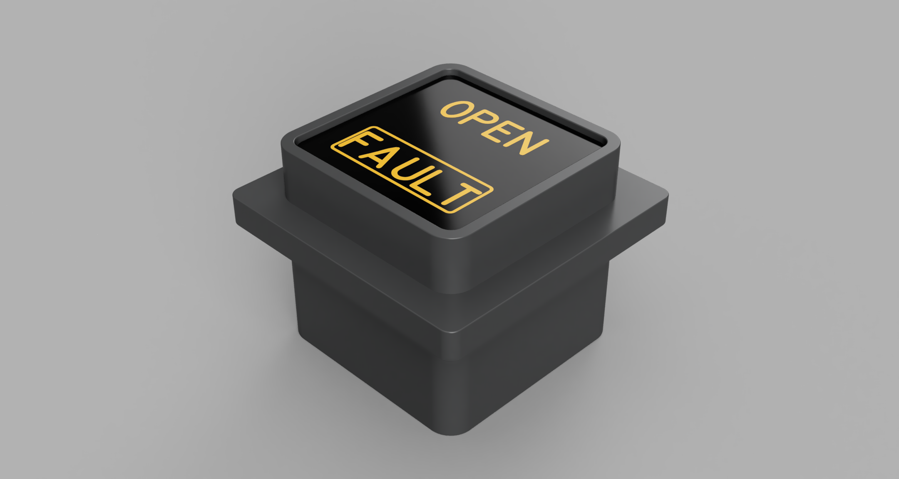

# Airbus A320
## Home Cockpit
### Announciator

The body can be 3d printed. The face is tricky to route. You have to route the two inner faces 2mm deep and the whole place on the outside by 3mm. See the picture below.

#### Hardware:
- 2x 5mm LED (Red/Amber): https://amzn.to/4h1cpyG
- Black spraypaint: https://amzn.to/4gPvXpR
- 2x Resistor*: https://amzn.to/3WfNnDQ

*The resistor should be calculated to the forward voltage of the LED and the voltage of arduino. In Arduino Nano on PIN 5 and PIN6 there is 5V. You should use one resistor per LED.
