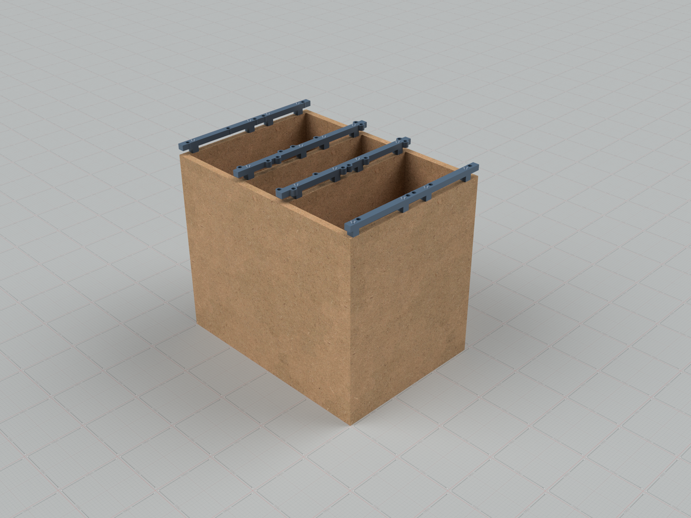
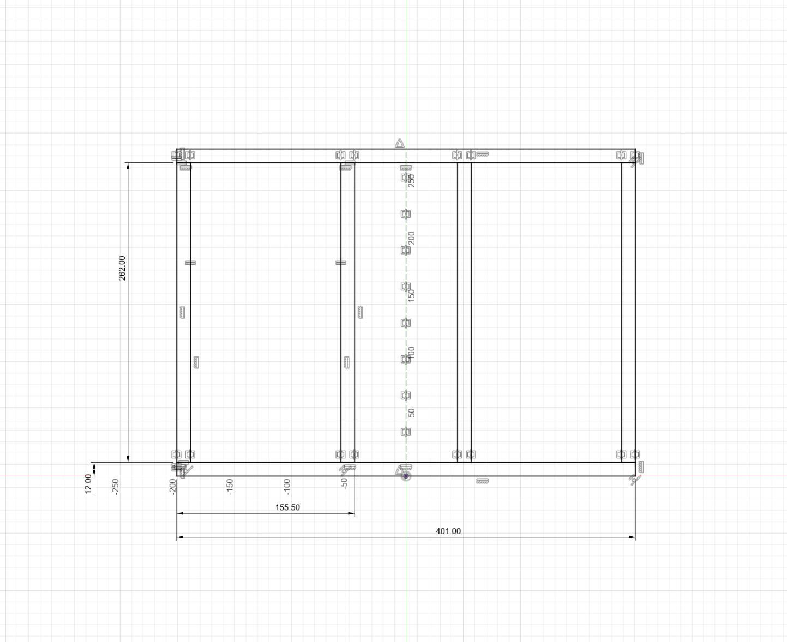

# Airbus A320
## Home Cockpit Pedestal base

### MDF Plates:
- Front & Back - 2x 401 x 340 x 12mm
- Left & Right & Inner - 4x 262 x 340 x 12mm
- Bottom - 1x 262 x 377 x 12mm

### Hardware:
- Threaded inserts: M5×9,5×7,3mm - https://amzn.to/3Watka1
- Wood screws
- RAL 5014 or RAL 7031 Spray paint(depending on if you want to pain in new or old version)

### Social media
- Discord: https://discord.gg/9MF7dtWe
- Youtube: https://www.youtube.com/@k-jak-karol
