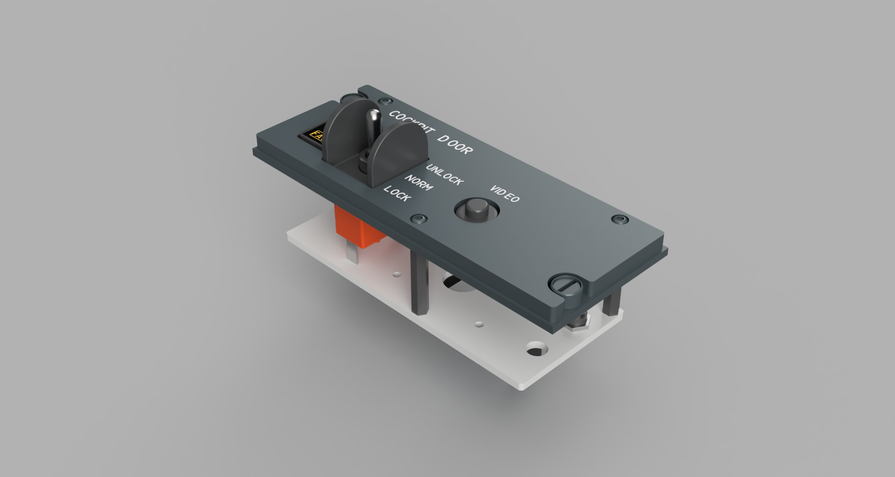

# Airbus A320 - Home Cockpit
## Pedestal - Cockpit Door Panel

### Parts:
- [Announciator](./../../misc/announciator)
- [DZUS](./../../misc/dzus)

### Hardware:
- COB LED Orange 2.7mm 12V - https://amzn.to/40soF5N
- Spray Paint (depending on the version old/new):
  - RAL 5014 - https://amzn.to/3C22f1O
  - RAL 7031 - https://amzn.to/4jazq3Z
- 1x Momentary switch (On)-Off-(On): https://amzn.to/4h9SfT5
- 1x Round Pushbutton 12mm: https://amzn.to/4a9n1t3
- 3x M3 Screw: https://amzn.to/4a9nlrL
- Set of crimp connectors: https://amzn.to/3E39vLm
- Wire ferrules: https://amzn.to/3PCMBwV
- Set of Hex Spacer Standoffs: https://amzn.to/3Pxw7Xc
