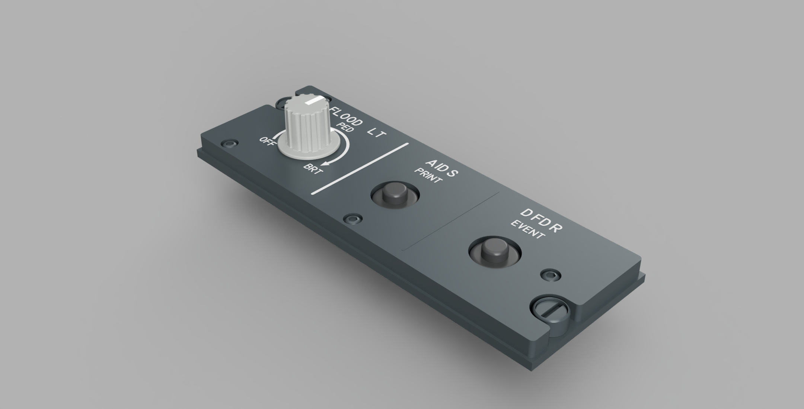

# Airbus A320 - Home Cockpit
## Pedestal - F/O Light Panel

YouTube Video: https://www.youtube.com/watch?v=RHGBdZT54NU

### STLs:
- Airbus A320 Lighting Knob - V2 by Mark Ayton: https://www.printables.com/model/441922-airbus-a320-lighting-knob-v2

### Parts:
- [DZUS](./../../misc/dzus)

### Hardware:
- [Common hardware](./../../)

- 2x Round Pushbutton 12mm: https://amzn.to/4a9n1t3
- 10k Potentiometer: https://amzn.to/40Wt4hv

### Scripts
- Potentiometer: `1023 @ - 10.23 / 76 (>K:2:LIGHT_POTENTIOMETER_SET)`

### Arduino pinout
|Type|Name|PIN|Variable|
|-|-|-|-|
|Input|DFDR Event|4||
|Input|AIDS Print|5||
|Input|Flood Light|6|A32NX LIGHTING_KNOB_PEDESTAL_SET|
