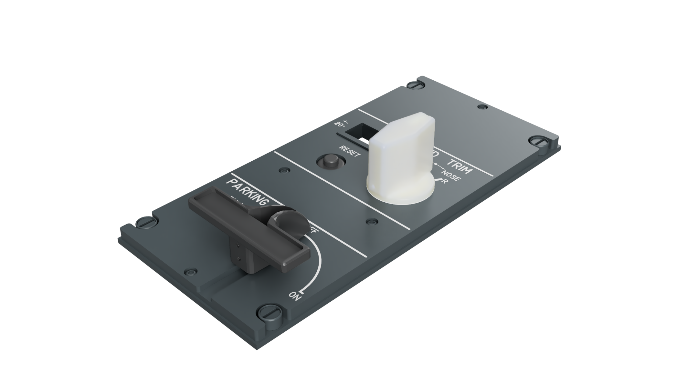

# Airbus A320 - Home Cockpit
## Pedestal - Rudder Trim

YouTube Video: tba

### STLs:
- Airbus A320 Rutter Trim Knob-V2 by Mark Ayton: https://www.printables.com/model/438609-airbus-a320-rudder-trim-knob-v2
- Airbus A320 Parking Brake Handle by Mark Ayton: https://www.printables.com/model/436160-airbus-a320-parking-brake-handle

### Parts:
- [DZUS](./../../misc/dzus

### Hardware:
- [Common hardware](./../../)
- 7-Segment Display wit MAX7219 Module: https://amzn.to/4au1awM
- 1x Round Pushbutton 12mm: https://amzn.to/4a9n1t3
- 90 degree Rotary Switch: https://amzn.to/4hpNkNW
- 3-position 45-degree Rotary Switch: https://amzn.to/4jtrivN
